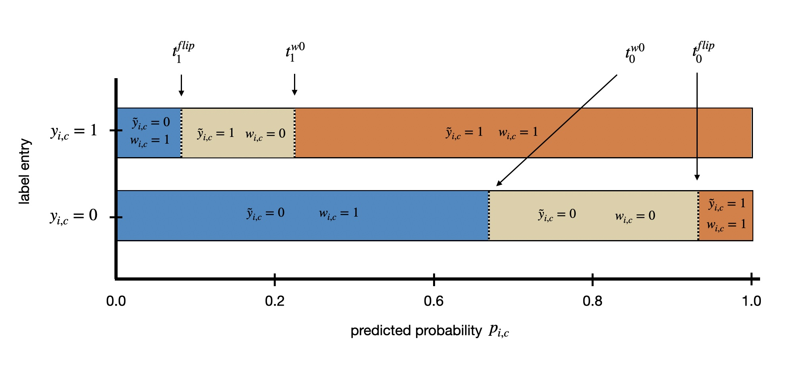

# NAR-MLC: Official Implementation

This repository contains the official implementation of **“Noise-Adaptive Regularization for Robust Multi-Label Remote Sensing Image Classification”** - Tom Burgert, Julia Henkel, Begüm Demir.

[](https://arxiv.org/abs/2601.08446)

The paper is currently under revision at **IEEE Transactions on Geoscience and Remote Sensing**.

## Overview

This repository provides code for training and evaluating noise robust methods under different types of multi-label noise. The main method, **NAR** (*Noise-Adaptive Regularization*), adapts the learning signal at the level of individual label entries. Depending on model confidence, label entries are retained, temporarily deactivated, or corrected via flipping. This confidence-based label handling is combined with early-learning regularization to improve robustness under additive, subtractive, and mixed multi-label noise.



For details, please see the paper.

## Installation

We recommend using conda:

```bash
git clone https://github.com/tomburgert/nar_mlc.git
cd nar_mlc

conda env create -f environment.yml
conda activate nar_mlc
```

Alternatively, dependencies can be installed with pip:

```bash
pip install -r requirements.txt
```

For GPU support, please install the PyTorch version that matches your CUDA setup. For example, for CUDA 12.1:

```bash
pip install torch==2.4.0 torchvision==0.19.0 --index-url https://download.pytorch.org/whl/cu121
pip install -r requirements.txt
```

## Data Preparation

Dataset paths are configured in:

```text
conf/datasets.yaml
```

Before running experiments, update the paths in this file to match your local data directories.

The repository contains dataset configurations for:

* BigEarthNet-V2
* DeepGlobe-ML
* UCMerced-ML
* AID-ML

Most datasets are expected in LMDB format, with labels and split files provided separately as `.csv` or `.parquet` files. The AID-ML loader uses the Hugging Face dataset `jonathan-roberts1/AID_MultiLabel` and creates deterministic train/validation/test splits internally.

A dataset entry in `conf/datasets.yaml` has the following structure:

```yaml
DatasetName:
  classification: multi_label
  lmdb_path: path/to/patches.lmdb
  labels_path: path/to/labels.parquet
  train_csv: path/to/train.csv
  val_csv: path/to/val.csv
  test_csv: path/to/test.csv
  num_classes: 17
  num_channels: 3
```

## Usage

The main entry point is:

```bash
python mlc_experiments.py
```

The code uses Hydra configuration files from `conf/`. Experiment settings can be changed either in the YAML files or overridden directly from the command line.

### Example: clean training with BCE

```bash
python mlc_experiments.py \
  params.dataset=UCMerced \
  params.addn=0.0 \
  params.subn=0.0 \
  params.mixed_noise=false \
  nrl.use_nrl=false \
  nrl.use_elr=false \
  model.name=resnet18 \
  model.pretrained=false \
  params.max_epochs=30 \
  logging.exp_dir=logs/ucmerced_bce_clean
```

### Example: additive label noise

```bash
python mlc_experiments.py \
  params.dataset=UCMerced \
  params.addn=0.4 \
  params.subn=0.0 \
  params.mixed_noise=false \
  nrl.use_nrl=false \
  model.name=resnet18 \
  params.max_epochs=30 \
  logging.exp_dir=logs/ucmerced_bce_additive_40
```

### Example: subtractive label noise

```bash
python mlc_experiments.py \
  params.dataset=UCMerced \
  params.addn=0.0 \
  params.subn=0.4 \
  params.mixed_noise=false \
  nrl.use_nrl=false \
  model.name=resnet18 \
  params.max_epochs=30 \
  logging.exp_dir=logs/ucmerced_bce_subtractive_40
```

### Example: mixed label noise

```bash
python mlc_experiments.py \
  params.dataset=UCMerced \
  params.addn=0.4 \
  params.subn=0.0 \
  params.mixed_noise=true \
  nrl.use_nrl=false \
  model.name=resnet18 \
  params.max_epochs=30 \
  logging.exp_dir=logs/ucmerced_bce_mixed_40
```

### Example: NAR with ELR

```bash
python mlc_experiments.py \
  params.dataset=UCMerced \
  params.addn=0.0 \
  params.subn=0.4 \
  params.mixed_noise=false \
  nrl.use_nrl=true \
  nrl.use_elr=true \
  nrl.p1_zero=0.94 \
  nrl.p2_zero=0.54 \
  nrl.p1_one=0.0 \
  nrl.p2_one=0.20 \
  model.name=resnet18 \
  params.max_epochs=30 \
  logging.exp_dir=logs/ucmerced_nar_elr_subtractive_40
```

## Noise Types

The code supports three synthetic multi-label noise settings:

* **Additive noise:** false positive labels are introduced by flipping selected `0` entries to `1`.
* **Subtractive noise:** false negative labels are introduced by flipping selected `1` entries to `0`.
* **Mixed noise:** additive and subtractive noise are applied jointly. If true, the value of addn is used for both noise types.

Noise rates can be controlled with:

```text
params.addn      additive noise rate
params.subn      subtractive noise rate
params.mixed_noise
```

## NAR Configuration

The main NAR options are configured under `nrl`:

```text
nrl.use_nrl              activate confidence-based label handling
nrl.use_elr              combine NAR with early-learning regularization
nrl.use_sat              use self-adaptive training baseline
nrl.use_asl              use asymmetric loss baseline
nrl.use_ral              use robust asymmetric loss baseline
nrl.use_balancemix       use BalanceMix baseline
nrl.use_oracle           use oracle label-noise handling experiments

nrl.p1_zero              flip highly confident noisy zeros to one
nrl.p2_zero              deactivate uncertain zeros
nrl.p1_one               flip highly confident noisy ones to zero
nrl.p2_one               deactivate uncertain ones

nrl.elr_lam              ELR regularization strength
nrl.elr_beta             ELR temporal ensembling momentum
```

Conceptually, NAR uses four thresholds:

```text
observed y = 0, high predicted probability    -> flip to 1
observed y = 0, intermediate probability      -> deactivate loss entry
observed y = 1, low predicted probability     -> flip to 0
observed y = 1, intermediate-low probability  -> deactivate loss entry
```

Deactivated entries receive loss weight zero and are therefore temporarily treated as unlabeled.

## Baselines

The repository includes implementations or switches for several baselines:

```text
BCE              binary cross-entropy
ELR              early-learning regularization
SAT              self-adaptive training
ASL              asymmetric loss
RAL              robust asymmetric loss
BalanceMix
Oracle
```

## Configuration

The main configuration files are located in `conf/`:

```text
conf/
├── config.yaml        # Main Hydra configuration
└── datasets.yaml      # Dataset paths and dataset-specific metadata
```

Important command-line arguments include:

```text
params.dataset          dataset name
params.seed             random seed
params.cuda_no          GPU id used when bypassing SLURM
params.max_epochs       number of training epochs
params.batch_size       batch size
params.num_workers      dataloader workers
params.addn             additive noise rate
params.subn             subtractive noise rate
params.mixed_noise      whether to use mixed-noise mode

model.name              model architecture: resnet18, resnet50, vit_b, efficientNet
model.pretrained        whether to use pretrained torchvision weights

optim.min_lr            learning rate
optim.weight_decay      weight decay

logging.exp_dir         output directory
logging.save_checkpoint whether to save checkpoints

tracking.should_track_train_probs
tracking.should_track_val_probs
tracking.should_track_labels
tracking.should_track_weights
tracking.should_track_noise_statistics
```

## Repository Structure

```text
nar_mlc/
├── conf/                 # Hydra configuration files
├── data/                 # Dataset classes, datamodules, transforms, noise injection utilities
├── lmdb/                 # LMDB helper code
├── base.py               # PyTorch Lightning module, losses, metrics, NAR update logic
├── config.py             # Dataclass-based Hydra configuration schema
├── loss.py               # ELR, SAT, ASL, and RAL losses
├── mlc_experiments.py    # Main training entry point
├── models.py             # ResNet, ViT, and EfficientNet wrappers
└── utils.py              # Schedulers and utility functions
```

## Outputs

Training logs are written to the directory specified by:

```bash
logging.exp_dir=<output_path>
```

The PyTorch Lightning CSV logger stores metrics under this directory. If tracking is enabled, the code can additionally save training probabilities, validation probabilities, labels, loss weights, and label-noise statistics as `.parquet` or `.csv` files.

The main validation metrics include:

```text
mAP micro / macro
per-class AP
F1 micro / macro
per-class F1
```

## Citation

If you use this repository, please cite:

```bibtex
@misc{burgert2026nar,
  title         = {Noise-Adaptive Regularization for Robust Multi-Label Remote Sensing Image Classification},
  author        = {Tom Burgert and Julia Henkel and Begüm Demir},
  year          = {2026},
  eprint        = {2601.08446},
  archivePrefix = {arXiv},
  primaryClass  = {cs.CV}
}
```

The paper is currently under revision at **IEEE Transactions on Geoscience and Remote Sensing**. The citation will be updated once the final publication metadata is available.
